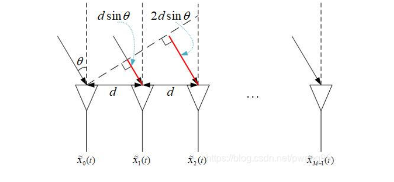
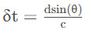
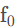
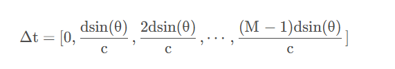
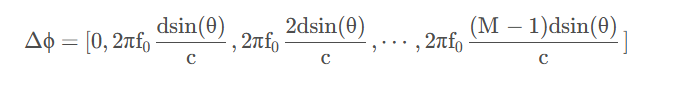
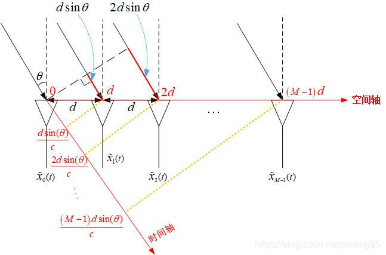
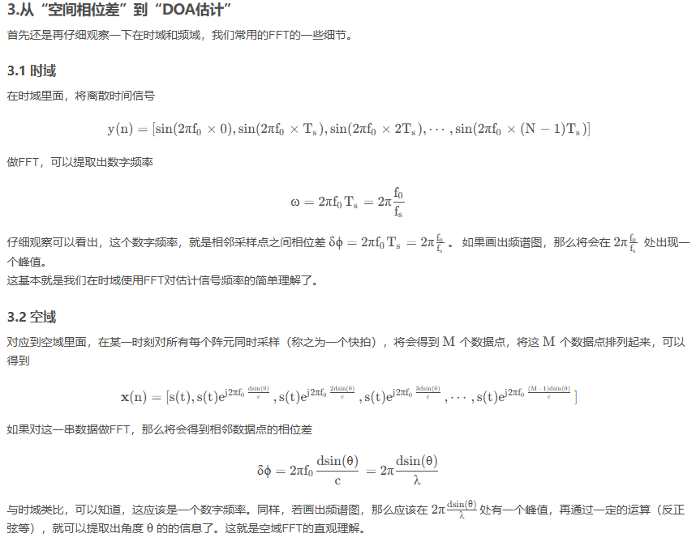
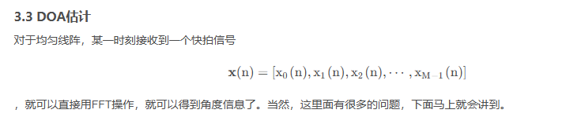

# DOA  

## 概念  
> DOA 是指空间中信号到达接收系统时的入射方向角度。  
> 在二维平面中，通常用方位角来表示；在三维空间中，则需要用方位角和俯仰角两个角度来确定信号的到达方向。  

## DOA估计  
> 时域频谱表示信号在各个频率上的能量分布；空间谱表示信号在空间各个方向上的能量分布。所以如果能够得到信号的空间谱，就能够得到信号的波达方向 (Direction of arrival, DOA) 所以空间谱估计也被称为DOA估计。

参考内容：
- 1.[阵列信号DOA估计系列(一).概述](https://blog.csdn.net/pwang95/article/details/104999880?ops_request_misc=%257B%2522request%255Fid%2522%253A%2522E09B9F20-C112-4CE6-82EE-8B78F56BD4BE%2522%252C%2522scm%2522%253A%252220140713.130102334..%2522%257D&request_id=E09B9F20-C112-4CE6-82EE-8B78F56BD4BE&biz_id=0&utm_medium=distribute.pc_search_result.none-task-blog-2~blog~sobaiduend~default-1-104999880-null-null.nonecase&utm_term=doa%E4%BC%B0%E8%AE%A1%E7%94%BB%E9%A2%91%E8%B0%B1%E5%9B%BE&spm=1018.2226.3001.4450)  
- 2.[基于MUSIC算法的DOA估计理论概述](https://blog.csdn.net/ccsss22/article/details/137613268?ops_request_misc=%257B%2522request%255Fid%2522%253A%25228851D835-1496-480A-9F35-6D533871CD29%2522%252C%2522scm%2522%253A%252220140713.130102334..%2522%257D&request_id=8851D835-1496-480A-9F35-6D533871CD29&biz_id=0&utm_medium=distribute.pc_search_result.none-task-blog-2~blog~top_click~default-2-137613268-null-null.nonecase&utm_term=DOA&spm=1018.2226.3001.4450)

  
### 实例  
- 均匀线性阵列，共有 M 个阵元，阵元之间相距 d ，有一个信号（假设为平面波）从偏离法线 θ 方向射入到阵列上。

  

可以看出，信号要到达第二个阵元所走过的路程比到达第一个阵元走过的路程要多dsin(θ),后面以此类推，信号要到达后面一个阵元都比前面一个阵元 多走dsin(θ)的空间距离。

我们都知道电磁波的速度为光速c cc,那么上面的路程计算到时间维度，可以得出：相同的信号，要到达后一个阵元，就比前一个阵元 在时间上 迟了  。假设信号的频率为，并且以第一个阵元为参考点，  
那么每一个阵元相对于第一个阵元的时间差为  
  

那么到达各个阵元的信号，相对于第一个阵元的相位差就应该是  
  
由于这个相位差是阵元间空间位置不同所造成的，顺便取了个名字为“空间相位差”。  
另外，可以从这个图的角度去理解。  
  

**后面的看不懂了**
  

  

