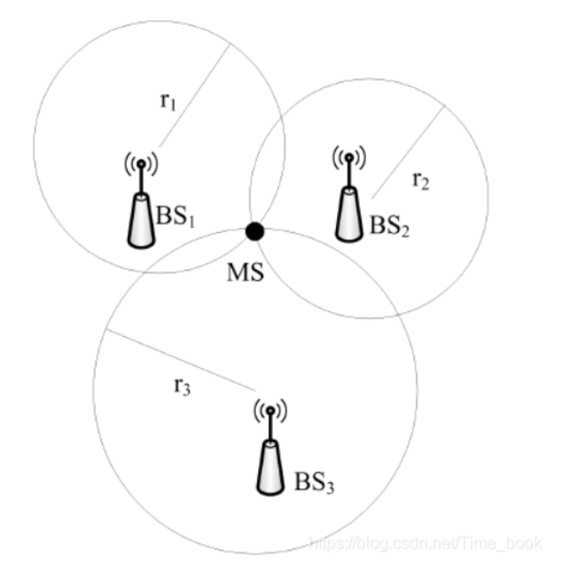
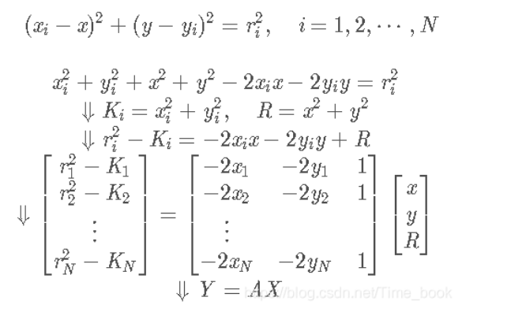
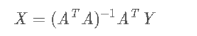

# TOA  算法  

##  最小二乘法  
- 误差：（真实值-理论值）  
- 二乘：平方  
  

目的：需要拟合的误差最小  

**“误差的平方和最小”**  

https://blog.csdn.net/MoreAction_/article/details/121591653
## 加权最小二乘法  

[matlab实现TOA定位算法](https://blog.csdn.net/Time_book/article/details/106339315?ops_request_misc=%257B%2522request%255Fid%2522%253A%25220DA74E5D-296C-43AB-AC37-84D60A3D2220%2522%252C%2522scm%2522%253A%252220140713.130102334.pc%255Fblog.%2522%257D&request_id=0DA74E5D-296C-43AB-AC37-84D60A3D2220&biz_id=0&utm_medium=distribute.pc_search_result.none-task-blog-2~blog~first_rank_ecpm_v1~rank_v31_ecpm-3-106339315-null-null.nonecase&utm_term=%E6%9C%80%E5%B0%8F%E4%BA%8C%E4%B9%98%E6%B3%95toa%E5%AE%9A%E4%BD%8D%E7%AE%97%E6%B3%95&spm=1018.2226.3001.4450)  

视距无线传输 (Line of Sight，LOS):BSn  

TOA原理：测量待定位节点MS（x，y）与发送端（xi，yi）的信号之间的到达时间，然后转换为距离，从而进行定位。三个基站到MS的距离分别为r1，r2，r3，以各自基站为圆心测量距离为半径，绘制三个圆，其交点即为 MS 的位置。当三个基站都是 LOS 基站时，一般可以根据最小二乘(LS)算法计算 MS的估计位置。假设 MS 位的置坐标为 (x,y)，N 个 BS的位置坐标为 (xi,yi))，根据其几何意义，则它们之间满足的关系是  
  
我们要求得坐标 (x,y)，即求得 X。利用最小二乘法可得  
  

