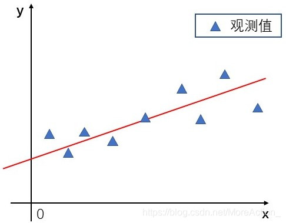
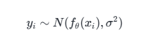

# TOA  算法  

##  最小二乘法  
- 误差：（真实值-理论值）  
- 二乘：平方  
  

目的：需要拟合的误差最小  

总结一下，如果误差项 \\(\epsilon\) 满足 \(\epsilon \sim N(0, \sigma^2)\)，那么在给定 \(x_i\) 和参数 \(\theta\) 的情况下，观测样本 \(y_i\) 的分布为：
\[ y_i \sim N(f_\theta(x_i), \sigma^2) \]
这表明 \(y_i\) 是围绕其预测值 \(f_\theta(x_i)\) 波动的，波动的幅度由误差项的方差 \(\sigma^2\) 决定。  

**“误差的平方和最小”**  

https://blog.csdn.net/MoreAction_/article/details/121591653
## 加权最小二乘法  

