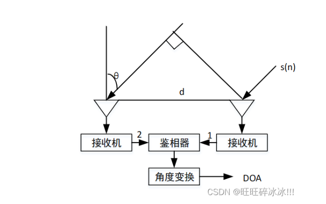
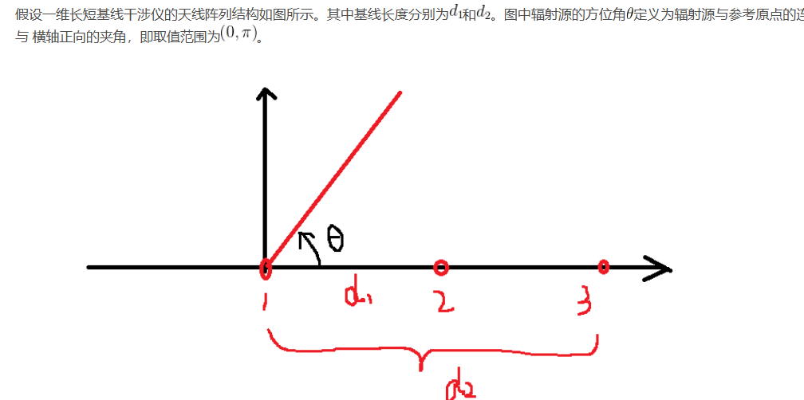

# 干涉仪侧向原理  

##  一、文献

[干涉仪侧向原理](./thesis/干涉仪侧向原理.pdf)  

## 二、相位干涉仪测向原理  

### 1.一维相位干涉仪  
- 数字式相位干涉仪  
  

  
相位差的计算方法：
通过测量两个接收点之间的时间差，然后将其转换为相位差。  
公式为：Δφ = 2π * Δt * f  
Δφ: 相位差  
Δt: 时间差  
f: 信号频率  

一维长短干涉仪侧向算法  
我们需要解决相位模糊的概念  
  


### 2.二维相位干涉仪  


## 三、相关干涉仪测向原理  


```
include<stdio.h>
int main()
{

    printf("Hello");
    return 0;
}


```

