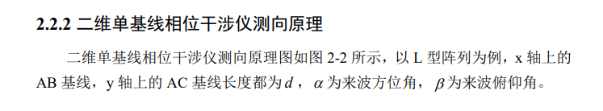
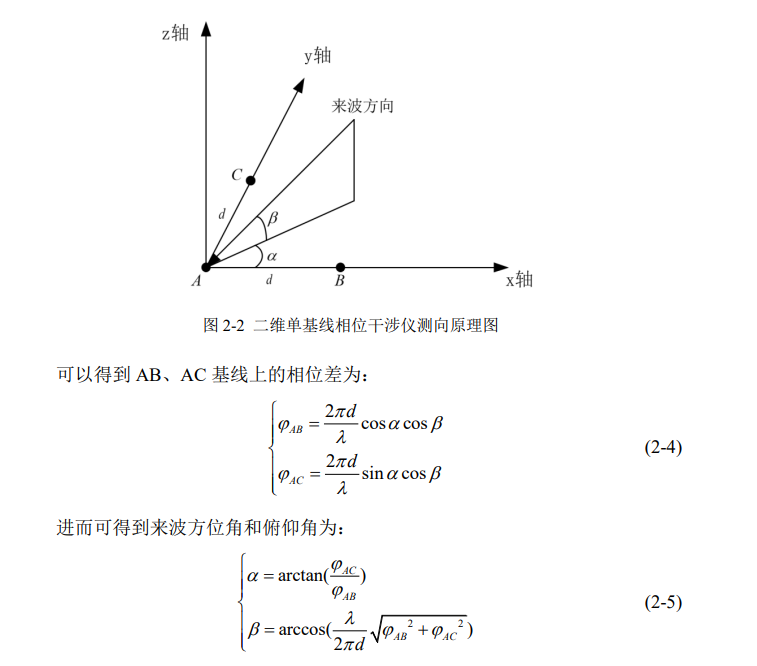

# 干涉仪侧向原理  

##  一、文献

[干涉仪侧向原理](./thesis/干涉仪侧向原理.pdf)  

## 二、相位干涉仪测向原理  

### 1.一维相位干涉仪  
- 数字式相位干涉仪  
  

  
相位差的计算方法：
通过测量两个接收点之间的时间差，然后将其转换为相位差。  
公式为：Δφ = 2π * Δt * f  
Δφ: 相位差  
Δt: 时间差  
f: 信号频率  

一维长短干涉仪侧向算法  
我们需要解决相位模糊的概念  
  

一维相位干涉仪存在前后方无法区分和相位模糊问题。

[csdn链接](https://blog.csdn.net/weixin_44924810/article/details/134849275)
### 2.二维相位干涉仪  
二维相位干涉仪可以同时测方位角和仰角，无相位模糊，但校准过程复杂。  
  
  
[参考文献](https://kns.cnki.net/kcms2/article/abstract?v=QenloEQs_R9Gs0TUbV6FcxSIWyOYlubb0acBxk4zv1j8tP-2fRrw5gcc04HcrfkEFdtp4tmL1XO2n7fWgCmax5cFliDxBDPbsxjpjwqMtC88LekW6rSXH7Co4Rk0dbCLQD3aGXM8863l6l6yjPkAoLq9ZvBQh2ZTuW1RQ9EPiSWXyt3j-_lKilCkFbDOoORXeoyW2OtpKbE=&uniplatform=NZKPT&language=CHS)  


## 三、相关干涉仪测向原理  

> 是利用多组基线的相位信息与样本数据进行相关,通过在空间搜索相关度最大的角度来获取角度信息,相应的算法称为相关干涉仪算法。  


```
include<stdio.h>
int main()
{

    printf("Hello");
    return 0;
}
```

